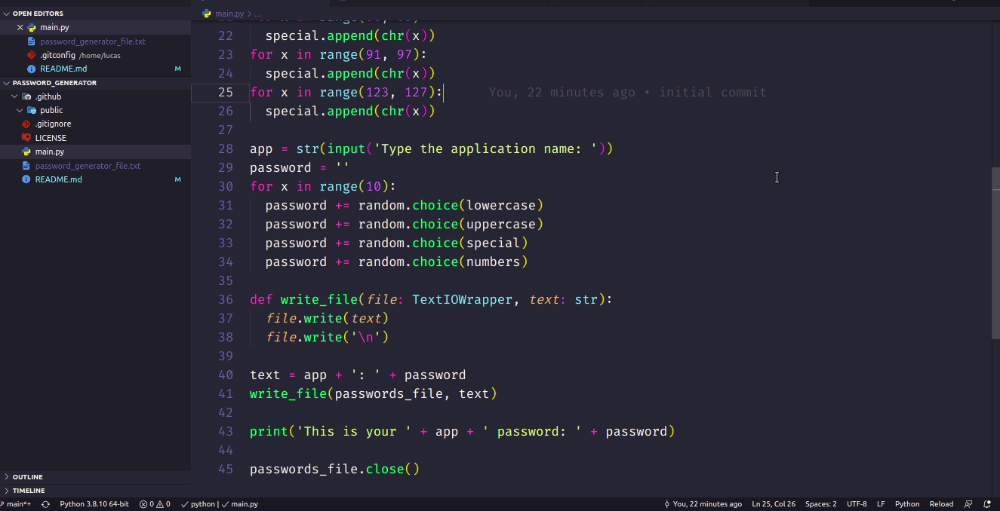

<p align="center">
  <h3 align="center">Password Generator</h3>

  <p align="center">
    This is a file script that generates passwords and stores them in a text file.
    <br />
    <a href="https://github.com/lucfersan/password_generator"><strong>Explore the docs »</strong></a>
    <br />
    <br />
    ·
    <a href="https://github.com/lucfersan/password_generator/issues">Report Bug</a>
    ·
    <a href="https://github.com/lucfersan/password_generator/issues">Request Feature</a>
  </p>
</p>

## 📙 Running example



## 🚀 Installation

1. Clone the repo
   ```sh
   git clone https://github.com/lucfersan/password_generator

## 🗞️ License

Distributed under the MIT License. See `LICENSE` for more information.

## 🤝 Contributing

Contributions are what make the open source community such an amazing place to be learn, inspire, and create. Any contributions you make are **greatly appreciated**.

1. Fork the Project
2. Create your Feature Branch (`git checkout -b feature/AmazingFeature`)
3. Commit your Changes (`git commit -m 'Add some AmazingFeature'`)
4. Push to the Branch (`git push origin feature/AmazingFeature`)
5. Open a Pull Request

## 📧 Contact

Lucas Fernandes - fernandes.lucas11@outlook.com